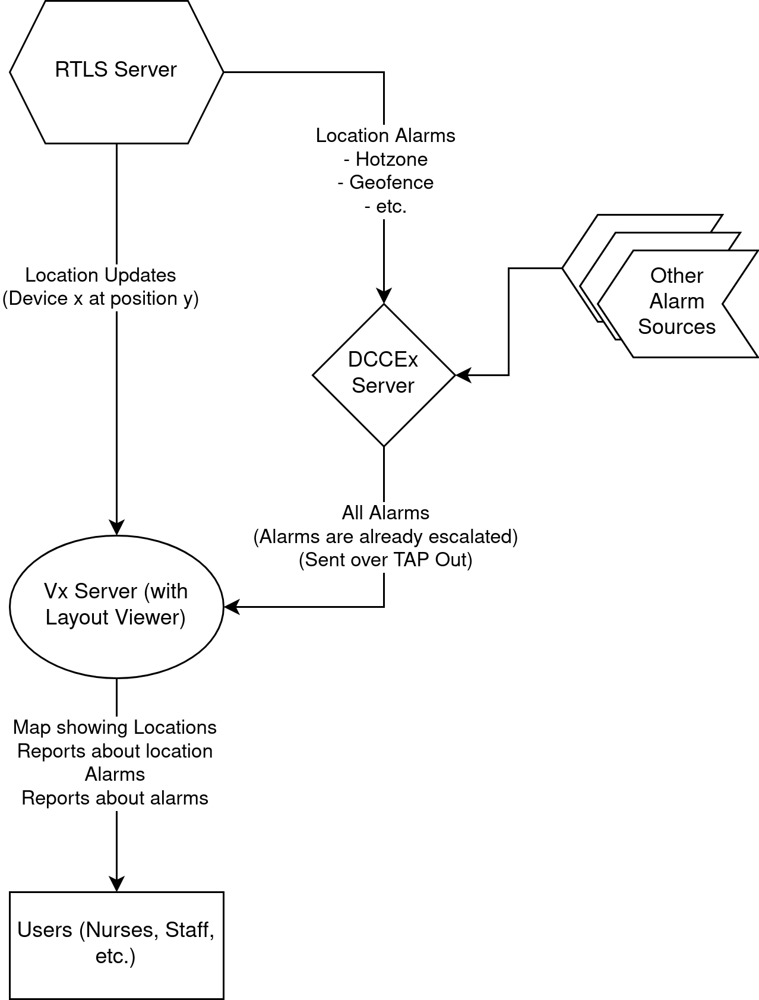
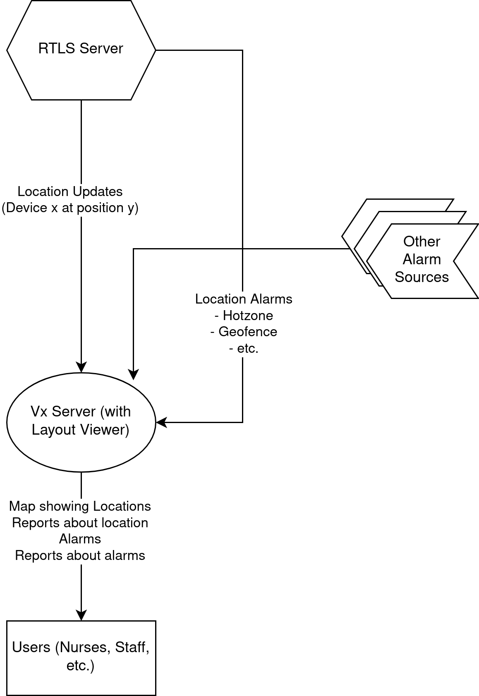
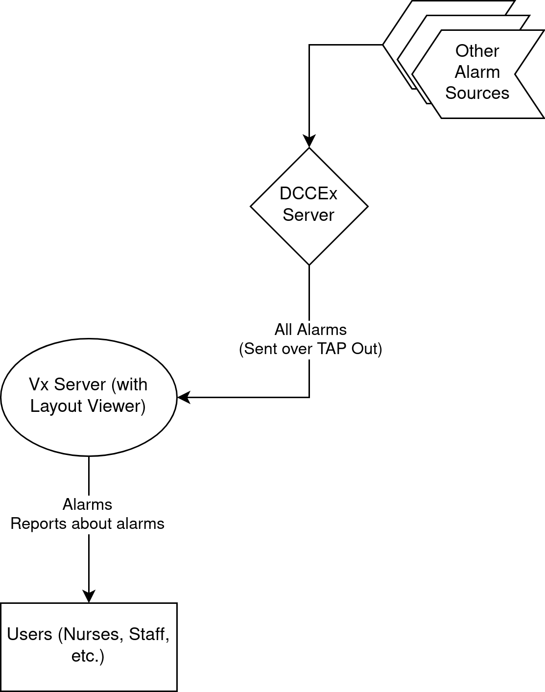

# Vx Setup Notes

## Alarms generated by each device

-   Minew B10
    -   Geofence
    -   HotZone
    -   Proximity
    -   Button
    -   LowBattery
    -   Disconnected
    -   TemperatureHigh
    -   TemperatureLow
-   Minew B7
    -   Geofence
    -   HotZone
    -   Proximity
    -   Button
    -   LowBattery
    -   Disconnected
    -   TemperatureHigh
    -   TemperatureLow
-   iSmarch
    -   Geofence
    -   HotZone
    -   Proximity
    -   Button
    -   LowBattery
    -   Disconnected
    -   OffWrist
    -   TemperatureHigh
    -   TemperatureLow
    -   HeartRateHigh
    -   HeartRateLow
-   DCare Android Phone (Support coming very soon)
    -   DCare Android can be tracked using RTLS, but no alarms can be configured at this time
-   DCare iOS Phone (No support)
    -   No RTLS integrations are supported at this time

## Required Configuration

-   DCCVx
    -   Request that DCCVx and RTLS are installed on a server (Vladan and Scott need to complete this step). You will need the hostname of this server for the next steps
    -   Create the configuration excel for the Vx server
        -   Create rows for all bracelets
        -   Create rows for all residents and associate residents to bracelets.
        -   Ensure each resident has alarms configured for their row
    -   Upload this excel document into the settings page of the Vx server
    -   Use the layout editor page of the Vx application to place all of the gateways and partitions onto the floor map (do this once for each layout)
-   Devices
    -   Install all gateways and configure them using the VxConfiguration application
    -   Configure all devices using the VxConfiguration application
-   DCCEx
    -   Ensure that DCCEx is pointing to the RTLS server hostname (if DCCEx is installed in that installation as well)
    -   Ensure that any necessary licensing is installed in DCCEx
    -   Ensure that the DCCVx server is pointing to DCCEx

## Possible Vx Deployment Flavors

### RTLS AND DCCEx

-   RTLS sends alarms (including location description) to DCCEx
-   RTLS sends real time location to DCCVx
-   DCCEx escalates and prioritizes alarms and then sends these alarms to DCCVx
-   DCCVx synthesizes the alarms and the locations together to show the map view with resident positions and flashing icons when there is an alarm
-   DCCVx can generate reports from the locations and the alarms

### RTLS Only

-   RTLS sends alarms (including location description) to DCCVx
-   RTLS sends real time location to DCCVx
-   DCCVx escalates and prioritizes alarms
-   DCCVx synthesizes the alarms and the locations together to show the map view with resident positions and flashing icons when there is an alarm
-   DCCVx can generate reports from the locations and the alarms

### DCCEx Only

-   RTLS does not exist in this setup
-   DCCVx acts primarily as an upgraded display for DCCEx
-   DCCEx escalates and prioritizes alarms
-   DCCEx displays any fixed-device alarms on the map. Any other alarms are only displayed on the alarm list
-   DCCVx can generate some simple reports from the alarms

