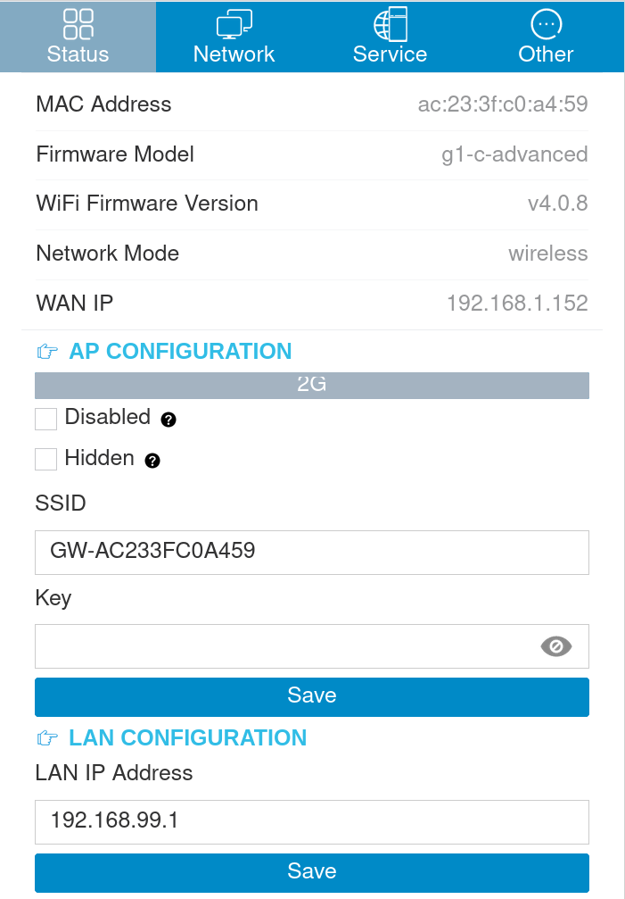
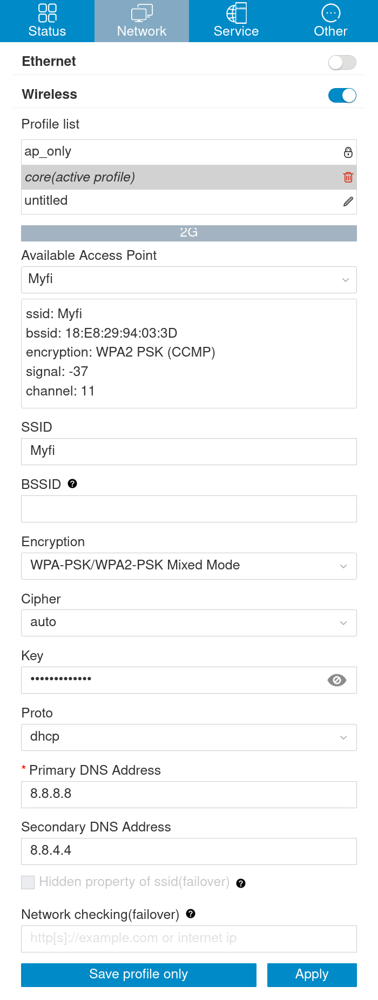
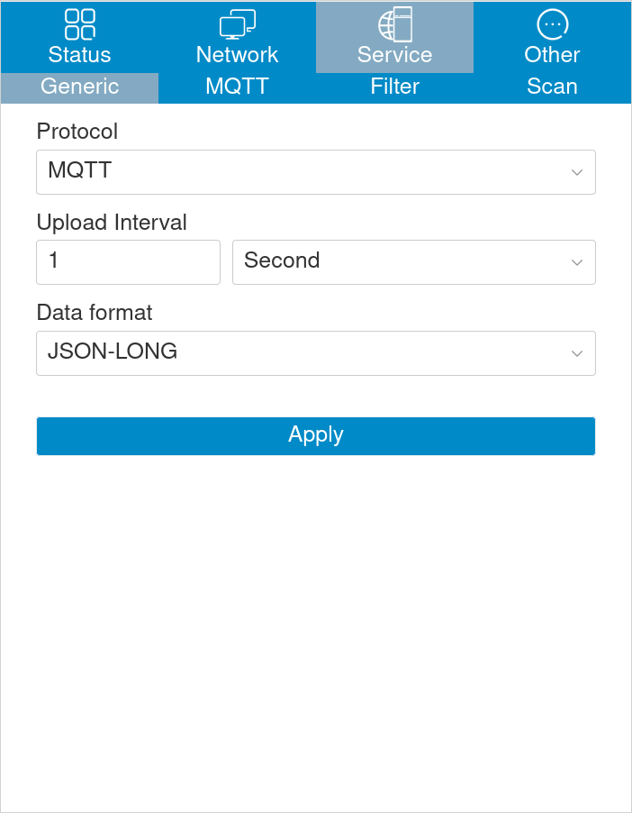
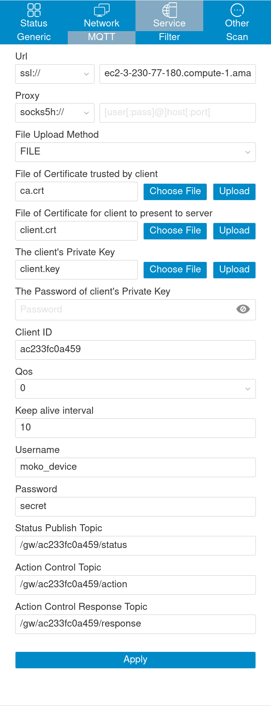
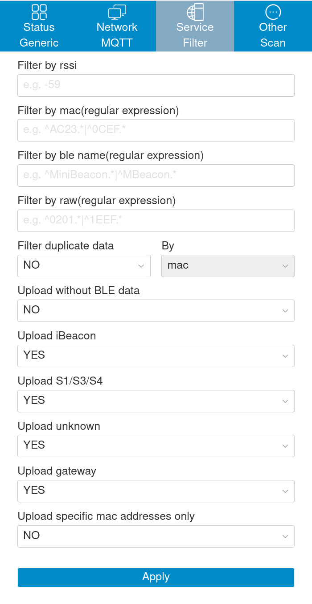

# Setup Instructions V1.0.3

## Changelog

-   2022-10-03 (v1.0.0): Initial Version
-   2022-10-04 (v1.0.1): Added manual gateway setup instructions
-   2022-10-27 (v1.0.2): Added tips for troubleshooting gateway scanning, and added a note about remote controlling the VxConfiguration application
    -   Added the _Gateway Setup -> Notes on Gateway Configuration over Wifi and Lan_ section
    -   Added the _Remote Control_ section
    -   Made updates to the _Gateway Setup -> Troubleshooting_ section
-   2022-10-31 (v1.0.3): Updated manual firmware upgrade to include support for 64M gateways
    -   Updated the _Gateway Setup -> Manual Firmware Upgrade_ section

## Prerequisites

1. Install the following applications on your phone
    - VxConfiguration needs to be sideloaded onto an android device. Download the APK from [this link](https://github.com/msdrigg/VxConfigurationReleases/blob/main/app-release.apk). Sideloading can be done with `adb` or by copying the apk file into the phone's downloads folder and installing it from there.
    - BeaconSET+ is available on the [Google Play Store](https://play.google.com/store/apps/details?id=com.minew.beaconplus) (for troubleshooting)
2. Install TeamViewer (or AnyDesk) on a computer that is connected to the same network that the gateways will be connected to (only required for troubleshooting)
    - Provide the TeamViewer ID and password to the Vx team
3. [Optional] Install the TeamViewer Host android application from [this link](https://play.google.com/store/apps/details?id=com.teamviewer.host.market&gl=US) on the same phone as the VxConfiguration application. This application can be used to allow the VxConfiguration support to remotely control the VxConfiguration application on your phone.
    - If you wish to allow remote control, the VxConfiguration support team will provide you a username and a password to login with.
    - Note that remote control is not compatible with configuring the gateways over wifi. It can only be used to configure beacons or to configure the gateways over LAN.
4. Open the VxConfiguration app and click on the `Settings` button in the top right corner
    - Enter the hostname of the Vx server provided by Vx team. NOTE: this hostname should NOT include the `https://` prefix or the `/` suffix. Please be careful because Android can automatically add these prefixes and suffixes when you paste the hostname into the text box.
    - Enter the SSID and password of the WIFI network that the gateways will be connected to. This must be a 2.4GHz network. Please note that both fields are case sensitive. Additionally, in the past there have been problems if the 5Ghz and 2.4Ghz networks share the same SSID. If the devices have trouble connecting, this could be the cause.
    - Click "Back" to return to the main screen. The settings already auto-save as you type.

## Gateway Setup (Minew G1)

### Notes on Gateway Configuration over Wifi vs Lan

Gateways broadcast an access point that allows configuring the gateway. The VxConfiguration will automatically connect to this access point and configure the gateway. This method will be used if the gateway is NOT connected to the same network as the phone running the VxConfiguration application. This method is generally less reliable than the LAN method.

Gateways can also be configured over LAN when the phone is connected to the same network as the gateway. This method is generally more reliable than over the access point.

1. To configure the gateways over LAN, gateways can be plugged into the router using an ethernet cable. The VxConfiguration application will scan an IP range for gateways to detect them. This IP range is configurable in settings, and this range can be automatically guessed by the VxConfiguration application based on the IP address assigned to the phone.
2. To configure the gateways over Wifi, simply plug the gateways into power and ensure the phone is in WiFi range. The VxConfiguration application will scan for gateways to detect them. This method will be disabled if the "Prevent disconnecting from the internet" setting is enabled in the VxConfiguration app.

### Part 1: Firmware Upgrade

**WARNING: DO NOT UNPLUG THE GATEWAY FROM POWER DURING THIS UPGRADE STEP. IF YOU UNPLUG THE GATEWAYS FROM POWER WHILE THEY ARE UPGRADING, THEY WILL NOT BE RECOVERABLE**

1. Ensure the gateways are powered on and connected to power
2. Open the VxConfiguration app and swipe down or click the triangle button to start scanning for gateways
3. Look for devices that have versions different from version "v4.0.8" exactly. Gateways will be listed in the app as "Minew G1 VERSION".
4. Once the gateways are found, click on the checkbox next to each gateway to select it
5. Click the "next" arrow button to upgrade the firmware on the selected gateways
6. The app should say "Firmware updated" if the firmware update is successfully triggered. If the app says "Firmware update failed", sometimes the firmware update will still be triggered. If the firmware update fails, try re-scanning for gateways and selecting the gateway again.
7. Once the firmware update has been triggered, you may need to wait up to 5 minutes for the firmware update to complete. When the firmware update is complete, the gateway will reboot and the gateway will scan the app and show it with the correct firmware version "v4.0.8"

### Configuring the gateways (After firmware upgrade)

1. Ensure the gateways are powered on and connected to power
2. Open the VxConfiguration app and swipe down or click the triangle button to start scanning for gateways
3. Look for devices that have version "v4.0.8" exactly. Gateways will be listed in the app as "Minew G1 VERSION".
4. Once the gateways are found, click on the checkbox next to each gateway to select it
5. Click the "next" arrow button to configure the gateways
6. The app should say "Configured" gateway is configured successfully. You may need to retry this step several times for it to complete successfully.
7. Once the firmware update has been configured, you should see it in the Vx connectivity portal.

### Troubleshooting

1. If the gateways are not found
    - Ensure that the gateways are powered on and nearby to your device
    - Open your wifi settings on the device and see if a network with the name "GW-XXXXXX" is visible. XXXXXX is the mac address of the gateway. If this network is detected, return to the VxConfiguration app and restart the scan. It may take several minutes for the gateways to show up in the scan, but this process can be sped up by alternating between the wifi settings and the VxConfiguration app. You can also try manually connecting to the "GW-XXXXXX" network and then restarting the scan.
    - If no such network is visible, try resetting the gateway by holding a pin in the reset hole for 10 seconds
    - If the gateway is still not found, try plugging the gateway directly into the router using an ethernet cable. It must be the same router that the setup phone is connected to. Then re-scan for gateways in the VxConfiguration app
    - If the gateways are taking too long to be found, you can disable the "Wifi scan throttling" setting in the Developer Options -> Network section of android settings.
    - If gateways are still not found, contact the Vx team for further troubleshooting
2. If gateway configuration repeatedly fails
    - Ensure that the Wifi SSID, Wifi password, and server host name are entered in the VxConfiguration app.
    - Ensure that the phone is connected to the same network that the gateways are trying to connect to
    - Continue trying. The processes is not 100% reliable and may take several attempts to complete
    - If the gateway configuration still fails, contact the Vx team for further troubleshooting
3. If the gateway configuration succeeds, but the gateways do not show up in the Vx connectivity portal
    - Ensure that the network that the gateways are connecting to has internet connectivity
    - Ensure that the gateways successfully connected to the wifi network (Check this by checking the router device list or by performing an ip scan). If the gateways are not connected to the wifi network, ensure that the wifi SSID and password are correct
    - If the gateways are connected to the network but not showing up in the Vx connectivity portal, ensure that the hostname does not have the `https://` prefix or the `/` suffix.
    - If the gateways are still not showing up, contact the Vx team for further troubleshooting

### Manual Firmware Upgrade

**WARNING: DO NOT UNPLUG THE GATEWAY DURING THE FIRMWARE UPGRADE PROCESS.
WARNING: IT IS VERY IMPORTANT THAT THE CORRECT FIRMWARE URL IS SELECTED IN STEP 7. IF THE WRONG URL IS SELECTED, THE GATEWAY WILL BECOME UNRECOVERABLE.**

1. If the gateways need to be upgraded manually, connect to the gateway's wifi network (GW-XXXXXX) and open a web browser to [http://192.168.99.1/](http://192.168.99.1/)
2. Log onto the gateway with the username `admin` and a blank password
3. Click on the network tab and select a wifi network with internet connectivity
4. Enter the wifi password and click the save button. Then click the "Apply" button to apply the changes.
5. Wait for the gateway to reboot and connect to the wifi network. Then reconnect to the gateway.
6. Go to the "Status" tab (the tab that shows initially after logging in), and find the "Firmware Model" section. Firmware model should be one of `g1-c`, `g1-c-64m`, `g1-c-advanced`, or `g1-c-64m-advanced`. If firmware model is something else, do not proceed. Contact support for troubleshooting.
7. Select the firmware upgrade url: If the firmware model is `g1-c-64m` or `g1-c-64m-advanced`, the firmware upgrade url is [https://s3.amazonaws.com/poltys.vx.rtls.tlscerts/v1/64m-g1-c-64m-advanced_wifi_v4.0.8.bin](https://s3.amazonaws.com/poltys.vx.rtls.tlscerts/v1/64m-g1-c-64m-advanced_wifi_v4.0.8.bin). If the firmware model is `g1-c` or `g1-c-advanced`, the firmware upgrade url is [https://s3.amazonaws.com/poltys.vx.rtls.tlscerts/v1/128m-g1-c-advanced_wifi_v4.0.8.bin](https://s3.amazonaws.com/poltys.vx.rtls.tlscerts/v1/128m-g1-c-advanced_wifi_v4.0.8.bin).
8. Go to the "Other" tab and find the Firmware Upgrade section.
9. Select "Lan Upgrade" and enter the firmware upgrade url (the value you selected in step 7) into the "Firmware URL" field.
10. Click "Upgrade" and wait for the gateway to upgrade. This may take up to 5 minutes.

### Manual Configuration

1. If the gateways need to be configured manually, connect to the gateway's wifi network (GW-XXXXXX) and open a web browser to [http://192.168.99.1/](http://192.168.99.1/)
2. Log onto the gateway with the username `admin` and a blank password
3. Set the gateways parameters following these screenshots

-   SSID: Should be GW-_Mac Address_
-   
-   Wifi should be selected from available networks
-   Wifi password should be entered into the "Key" field
-   
-   
-   The URL field should be set to _Server Host_:8833
-   Certificate files should be uploaded manually. Download the files from these links
    -   `ca.crt`: [download link](https://s3.amazonaws.com/poltys.vx.rtls.tlscerts/v1/ca.crt)
    -   `client.crt`: [download link](https://s3.amazonaws.com/poltys.vx.rtls.tlscerts/v1/client.crt)
    -   `client.key`: [download link](https://s3.amazonaws.com/poltys.vx.rtls.tlscerts/v1/client.key)
-   The "Client ID" should be the mac address of the gateway
-   The Status Publish Topic should be `/gw/<MAC>/status`
-   The Action Control Topic should be `/gw/<MAC>/action`
-   The Action Control Response Topic should be `/gw/<MAC>/response`
-   
-   Make sure "Upload Unknown" is set to true
-   
-   
-   

## Beacon Setup

1. Open the applicatoin settings and ensure that "Enable Accelerometer" is disabled.
2. Scan for beacons the same way you scanned for gateways. Beacons will be listed as "Minew Beacon".
3. Select the beacons you want to configure and press the "next" arrow button to configure them
4. The app should say "Configured" if the beacons are configured successfully. You may need to retry this step several times for it to complete successfully.
5. Once the beacons are configured, you should see them in the Vx connectivity portal (as long as there is at least one setup gateway nearby).

### Troubleshooting

1. If the beacons are not found
    - Open the BeaconSET+ application to see if the beacons are visible. If they are not visible, follow the steps below
    - Ensure that the beacons are powered on and nearby to your device. The beacon power can be toggled by holding the button on the beacon for 5 seconds. (Note, if the beacons are already powered on, the power button will turn them off)
    - Ensure the beacon has sufficient battery power. Try charging the beacons for a few minutes (or replace their battery if they are not rechargeable)
    - If beacons are still not found, contact the Vx team for further troubleshooting
2. If beacon configuration repeatedly fails
    - Try the configuration multiple times. The processes is not 100% reliable and may take several attempts to complete
    - Ensure that the phone is nearby to the configured beacons. If the rssi shown in the app is less than -70, the beacon configuration is likely to fail
    - Try connecting to the beacon with the BeaconSET+ application. If the beacon is not detected or connectable in the BeaconSET+ application, there may be an issue with the beacon itself
    - If the beacon configuration still fails, contact the Vx team for further troubleshooting
3. If the beacon configuration succeeds, but the beacons do not show up in the Vx connectivity portal
    - Ensure that the beacons are powered on and nearby to a gateway that is connected to the portal
    - Ensure the beacons are detected by the BeaconSet+ application.
    - If the beacons are still not showing up, contact the Vx team for further troubleshooting

## Remote Control

1. Open the Teamviewer Host application on a device that is connected to the same network as the gateways (and has the VxConfiguration app installed)
2. Contact Vx Support to get a username and password for a teamviewer account
3. Enter any alias that you would like to use for the device
4. BEFORE PERFORMING ANY VX CONFIGURATION ACTIONS: Enable the "Prevent disconnecting from the internet" setting in the VxConfiguration -> Settings -> Advanced. This will prevent the application from automatically connecting to the G1 wifi networks during scanning and configuration. This is important because as soon as the device connects to the G1 wifi network, it will lose internet connectivity and the teamviewer connection will be lost. This setting should be disabled when the remote session is complete so that the app can function normally.
